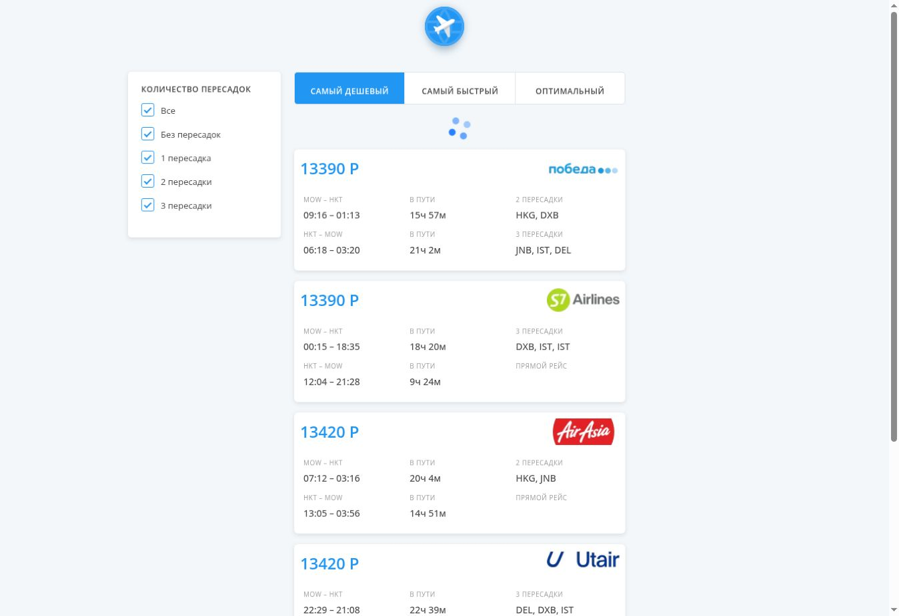

# Flight Tickets

Учебное React-приложение для просмотра авиабилетов с фильтрацией по пересадкам и сортировкой.

[Демо](https://aviasales-app-mu-nine.vercel.app/)



## Возможности

- Порционная загрузка билетов через внешний API.
- Фильтры по количеству пересадок для обоих сегментов перелёта.
- Сортировка по цене и суммарной продолжительности перелётов.
- Постепенное увеличение количества отображаемых билетов.
- Индикатор загрузки и сообщение об ошибке.

## Стек

React, JavaScript, Redux Toolkit, createAsyncThunk, createSelector, SCSS Modules, Create React App.

## Технические решения

Загрузка партий билетов вынесена в async thunk. Для временных ошибок 500/502 реализованы повторные попытки. Видимый список вычисляется через мемоизированный селектор: фильтрация → сортировка → ограничение количества карточек.

## Локальный запуск

```bash
npm ci
npm run start
```

`npm run build` — сборка, `npm run lint` — проверка кода.


## Проверки и ограничения

`CI=true npm test -- --watchAll=false --runInBand` проверяет сортировку по обоим перелётам, фильтры, завершение загрузки и защиту от повторного запроса. При снятии всех фильтров список пуст. Доступны сортировки «Самый дешёвый» и «Самый быстрый».

Доступность данных зависит от внешнего API Kata Academy.
